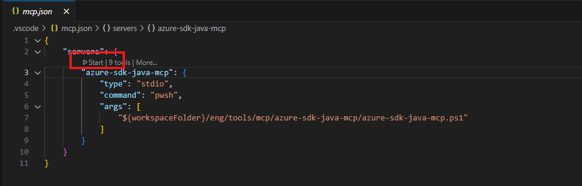

# MCP Server for Java SDK Tools

A Model Context Protocol (MCP) server that provides comprehensive tools for generating, building, and managing Java SDKs from TypeSpec definitions using the `tsp-client` tool.

## Features

This MCP server provides the following tools:

1. **init_java_sdk** - Initialize tsp-location.yaml for Java SDK from a tspconfig.yaml URL
2. **sync_java_sdk** - Synchronize/Download TypeSpec source for Java SDK
3. **generate_java_sdk** - Generate or update Java SDK from TypeSpec definitions
4. **clean_java_source** - Clean Java source files in the SDK directory
5. **build_java_sdk** - Build the Java SDK for Azure services
6. **get_java_sdk_changelog** - Get changelog for the Java SDK
7. **instruction_migrate_typespec** - Get instructions for migrating from Swagger to TypeSpec
8. **update_client_name** - Update client names in both TypeSpec and generated Java SDK
9. **prepare_java_sdk_environment** - Get step-by-step environment setup instructions

## Prerequisites

Before using this MCP server, ensure you have:

1. **Project Structure** - A directory containing `tsp-location.yaml`, open in this directory, e.g. `/sdk/batch/azure-compute-batch`.
2. **Nodejs** installed.

## Installation

1. Install dependencies:
```bash
npm install
```

2. Build the project:
```bash
npm run build
```

## Configure MCP Server in VSCode

To use this MCP server with GitHub Copilot in VSCode, you need to add it to your MCP configuration file.

### Step 0: Open Service Directory

Open the service directory that contains `tsp-location.yaml` in VSCode. This should be the specific service directory within the Azure SDK for Java repository. e.g. `azure-sdk-for-java/tree/main/sdk/batch/azure-compute-batch`

Make sure the directory you open contains the `tsp-location.yaml` file, as this is where the MCP tools will operate.

Create `.vscode/` folder in the directory.

### Step 1: Add Server Configuration

Add the following configuration to your `.vscode/mcp.json` file:

```json
{
    "servers": {
        "java-sdk-mcp": {
            "type": "stdio",
            "command": "node",
            "args": ["path/to/your/mcp/dist/index.js"]
        }
    }
}
```

Replace `path/to/your/mcp/dist/index.js` with the actual absolute path to your compiled MCP server. (Refer to [Installation](https://github.com/haolingdong-msft/java-sdk-tools/blob/main/mcp/README.md#installation) section to install and build the MCP server.)

### Step 2: Restart VSCode

After adding the configuration, restart VSCode for the changes to take effect.

### Step 3: Start the MCP Server

Click the 'Start' button in mcp.json.


You can verify that the MCP server is working by:
1. Opening GitHub Copilot Chat in VSCode
2. Asking Copilot to list available tools
3. You should see the Java SDK tools listed

### Example Configuration

Here's a complete example of what your `mcp.json` might look like:

```json
{
    "servers": {
        "java-sdk-mcp": {
            "type": "stdio",
            "command": "node",
            "args": [
                "C:\\workspace\\java-sdk-tools\\mcp\\dist\\index.js"
            ]
        }
    }
}
```

### Troubleshooting

If the MCP server isn't working:
1. Ensure the path to `index.js` is correct and absolute
2. Make sure you've built the project with `npm run build`
3. Check that Node.js is installed and available in your PATH
4. Restart VSCode completely after configuration changes
5. Check the VSCode developer console for any error messages


## Sample Prompts

Here are some example prompts you can use with GitHub Copilot to interact with the Java SDK tools:

### Basic SDK Operations
- `update java sdk`
- `build java sdk`
- `clean java source`

### SDK Initialization
- `initialize java sdk from https://github.com/Azure/azure-rest-api-specs/blob/main/specification/batch/Batch/tspconfig.yaml`
- `prepare java sdk environment`

### Client Name Updates
- `update client name: EnableBatchJobOptions to BatchJobEnableOptions`
- `update client name: MediaMessageContent.mediaUri to MediaMessageContent.mediaUrl`

### Build and Changelog
- `build the java sdk for com.azure.batch`
- `get changelog for the java sdk`
- `show me the changelog for the built SDK`

### Generate SDK after Migrating from Swagger to TypeSpec 
- `generate sdk after migrating to typespec`


## Development

To run in development mode with automatic recompilation:
```bash
npm run dev
```

To run tests:
```bash
npm test              # Run tests in watch mode
npm run test:run      # Run tests once
```

## Tools Documentation

### 1. init_java_sdk
Initialize the tsp-location.yaml configuration file for Java SDK generation.

**Parameters:**
- `cwd` (required): The absolute path to the workspace root directory
- `tspConfigUrl` (required): The URL to the tspconfig.yaml file (e.g., GitHub raw URL)

**Example:**
```json
{
  "name": "init_java_sdk",
  "arguments": {
    "cwd": "/path/to/workspace",
    "tspConfigUrl": "https://github.com/Azure/azure-rest-api-specs/blob/main/specification/service/tspconfig.yaml"
  }
}
```

### 2. sync_java_sdk
Synchronize and download the TypeSpec source files for Java SDK from the configuration in tsp-location.yaml.

**Parameters:**
- `cwd` (required): The absolute path to the directory containing tsp-location.yaml

**Example:**
```json
{
  "name": "sync_java_sdk",
  "arguments": {
    "cwd": "/path/to/typespec/project"
  }
}
```

### 3. generate_java_sdk
Generate or update Java SDK from TypeSpec definitions. Requires existing tsp-location.yaml and TempTypeSpecFiles directory.

**Parameters:**
- `cwd` (required): The absolute path to the directory containing tsp-location.yaml

**Example:**
```json
{
  "name": "generate_java_sdk",
  "arguments": {
    "cwd": "/path/to/typespec/project"
  }
}
```

### 4. clean_java_source
Clean Java source files in the specified SDK directory.

**Parameters:**
- `moduleDirectory` (required): The absolute path to the Java SDK directory

**Example:**
```json
{
  "name": "clean_java_source",
  "arguments": {
    "moduleDirectory": "/path/to/java/sdk/module"
  }
}
```

### 5. build_java_sdk
Build the Java SDK for Azure services (groupId starting with `com.azure`).

**Parameters:**
- `cwd` (required): The absolute path to the workspace root directory
- `moduleDirectory` (required): The absolute path to the Java SDK directory
- `groupId` (required): The group ID for the Java SDK
- `artifactId` (required): The artifact ID for the Java SDK

**Example:**
```json
{
  "name": "build_java_sdk",
  "arguments": {
    "cwd": "/path/to/workspace",
    "moduleDirectory": "/path/to/java/sdk/module",
    "groupId": "com.azure.myservice",
    "artifactId": "azure-myservice"
  }
}
```

### 6. get_java_sdk_changelog
Get the changelog for the Java SDK for Azure services.

**Parameters:**
- `cwd` (required): The absolute path to the workspace root directory
- `jarPath` (required): The absolute path to the JAR file (should be under the `target` directory)
- `groupId` (required): The group ID for the Java SDK
- `artifactId` (required): The artifact ID for the Java SDK

**Example:**
```json
{
  "name": "get_java_sdk_changelog",
  "arguments": {
    "cwd": "/path/to/workspace",
    "jarPath": "/path/to/target/azure-myservice-1.0.0.jar",
    "groupId": "com.azure.myservice",
    "artifactId": "azure-myservice"
  }
}
```

### 7. instruction_migrate_typespec
Get instructions for generating Java SDK after migrating from Swagger to TypeSpec.

**Parameters:**
- None

**Example:**
```json
{
  "name": "instruction_migrate_typespec",
  "arguments": {}
}
```

### 8. update_client_name
Update client names for both TypeSpec files and the generated Java SDK. Provides instructions for renaming.

**Parameters:**
- None (the tool returns instructions that guide you through the update process)

**Example:**
```json
{
  "name": "update_client_name",
  "arguments": {}
}
```

### 9. prepare_java_sdk_environment
Get step-by-step instructions to prepare the environment for Java SDK generation.

**Parameters:**
- `cwd` (required): The absolute path to the working directory where the environment should be prepared

**Example:**
```json
{
  "name": "prepare_java_sdk_environment",
  "arguments": {
    "cwd": "/path/to/workspace"
  }
}
```

## Usage

This server is designed to be used with MCP-compatible clients. The server communicates via stdio and provides tools for the complete Java SDK generation workflow.

### Typical Workflow

1. **Initialize**: Use `init_java_sdk` to set up tsp-location.yaml
2. **Prepare Environment**: Use `prepare_java_sdk_environment` for setup instructions
3. **Sync**: Use `sync_java_sdk` to download TypeSpec sources
4. **Generate**: Use `generate_java_sdk` to create the Java SDK
5. **Clean**: Use `clean_java_source` if needed to clean generated files
6. **Build**: Use `build_java_sdk` to compile the SDK
7. **Changelog**: Use `get_java_sdk_changelog` to get version information

## Project Structure

```
mcp/
├── src/
│   ├── index.ts               # Main MCP server implementation
│   ├── generate-java-sdk.ts   # Java SDK generation logic
│   ├── init-java-sdk.ts       # SDK initialization utilities
│   ├── build-java-sdk.ts      # SDK building functionality
│   ├── clean-java-source.ts   # Source cleaning utilities
│   ├── client-name-update.ts  # Client name update instructions
│   ├── brownfield-migrate.ts  # Migration instructions
│   ├── java-sdk-changelog.ts  # Changelog generation
│   ├── prepare-environment.ts # Environment setup instructions
│   ├── resources/             # Resource files and templates
│   └── utils/
│       ├── index.ts          # Utility functions for process execution
│       ├── process.ts        # Process spawning and execution utilities
│       └── process.spec.ts   # Tests for process utilities
├── dist/                     # Compiled JavaScript output
├── package.json              # Project dependencies and scripts
├── tsconfig.json             # TypeScript configuration
├── vitest.config.ts          # Test configuration
├── eslint.config.js          # ESLint configuration
└── README.md                 # This file
```

## Contributing

1. Make changes to the TypeScript source files in `src/`
2. Add tests for new functionality in `src/**/*.spec.ts`
3. Build the project with `npm run build`
4. Test your changes with `npm test` and `npm start`

## License

MIT
